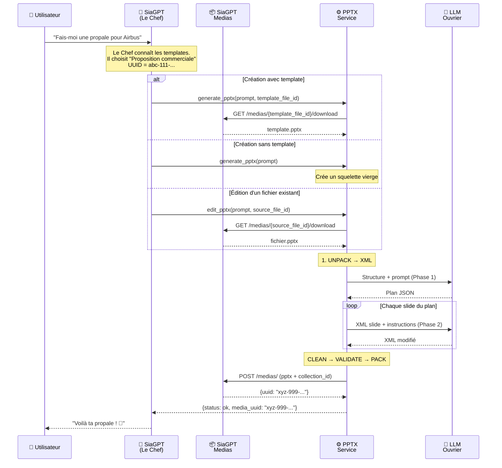
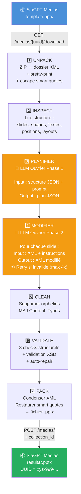

# PPTX Service

Micro-service qui génère et modifie des présentations PowerPoint via LLM.
Conçu pour s'intégrer à SiaGPT (via MCP ou API REST).

**Principe clé** : le LLM ne génère jamais de code — il lit et retourne du XML PowerPoint directement. Zéro `exec()`, zéro risque d'exécution arbitraire.

---

## Comment ça marche (vue d'ensemble)

### Petit rappel : un fichier .pptx, c'est quoi ?

Un fichier PowerPoint `.pptx` n'est rien d'autre qu'un **fichier ZIP** contenant des fichiers XML. Si tu renommes `presentation.pptx` en `presentation.zip` et que tu l'ouvres, tu verras :

```
presentation.zip/
├── [Content_Types].xml          ← "Registre" : liste tous les fichiers et leur type
├── _rels/.rels                  ← Liens entre fichiers (qui référence qui)
├── ppt/
│   ├── presentation.xml         ← La "table des matières" (ordre des slides)
│   ├── slides/
│   │   ├── slide1.xml           ← Le contenu de chaque slide (texte, positions, styles)
│   │   ├── slide2.xml
│   │   └── ...
│   ├── slides/_rels/
│   │   ├── slide1.xml.rels      ← Les liens de la slide 1 (layout, images, notes)
│   │   └── ...
│   ├── slideLayouts/            ← Les modèles de mise en page
│   ├── slideMasters/            ← Le style global (couleurs, polices du thème)
│   ├── theme/                   ← La palette de couleurs et polices
│   └── media/                   ← Les images embarquées
└── docProps/                    ← Métadonnées (auteur, date, etc.)
```

Notre service travaille directement sur ces fichiers XML — c'est comme ça qu'on modifie le texte, les styles et la structure sans jamais casser le formatage.

### Les deux LLM

Il y a deux LLM dans le système, avec des rôles distincts :

- **Le Chef** = le LLM de SiaGPT (celui à qui l'utilisateur parle dans le chat). Il comprend la demande, choisit le bon template, décide d'appeler `generate_pptx` ou `edit_pptx`. Il ne touche jamais au PPTX lui-même.
- **L'Ouvrier** = le LLM appelé par ce service (via l'API `/chat/plain_llm`). Il reçoit du XML brut et des instructions techniques, et retourne du XML modifié. Il ne sait rien de la collection, des templates, ni de l'utilisateur.

### Où sont stockés les templates Sia ?

Les templates Sia Partners sont des fichiers `.pptx` stockés dans **SiaGPT Medias** (même système que les fichiers utilisateur). Chaque template a un UUID.

```
SiaGPT Medias (collection)
├── 📄 abc-111-...  Template Sia - Proposition commerciale.pptx
├── 📄 abc-222-...  Template Sia - Comité de pilotage.pptx
├── 📄 abc-333-...  Template Sia - Rapport de mission.pptx
├── 📄 xyz-444-...  ma-presentation-modifiee.pptx  (fichier utilisateur)
└── ...
```

**C'est le Chef qui connaît les templates** (via son system prompt). Quand l'utilisateur dit "fais-moi une propale", le Chef sait qu'il faut utiliser le template "Proposition commerciale" et passe son UUID au service.

### Modèle vs Charte graphique — séparation architecturale

Un template Sia contient souvent des slides "guide de style" (palette de couleurs, règles d'utilisation, instructions). Ces slides sont de la **documentation pour humains**, pas des layouts de contenu.

On sépare les deux :

```
MODÈLE .pptx (= master template)        CHARTE GRAPHIQUE sia_theme.md (= brand guidelines)
─────────────────────────────            ─────────────────────────────────────────────────
Les layouts de contenu                   La palette Sia 2024 (couleurs par ref thème)
Les positions des shapes                 La police Sora-SIA
Les placeholders                         Les règles d'utilisation des couleurs
La structure                             Les design tokens (tailles, marges)
= ce que le LLM MODIFIE                 = ce que le LLM RESPECTE sans y toucher
```

Les slides guide (couleurs, "how to use", "delete before use") doivent être **supprimées** du modèle avant de l'uploader dans la collection. La charte graphique est extraite dans `sia_theme.md`, chargée par le service au démarrage et injectée dans le system prompt de l'Ouvrier.

Le LLM Ouvrier n'a pas besoin de "fiches techniques" des templates — il les analyse lui-même à l'étape INSPECT. Il a juste besoin de la charte graphique pour produire un résultat conforme.

### Le workflow complet

#### Diagramme visuel (rendu par GitHub)



#### Tous les inputs/outputs du service

```
INPUTS (ce que le Chef envoie au service)
─────────────────────────────────────────
┌─────────────────────────────────────────────────────────────────────┐
│  generate_pptx                                                      │
│  ├── prompt            (requis)  "Crée une propale pour Airbus"     │
│  └── template_file_id  (option)  "abc-111-..." UUID du template     │
│                                  Si omis → squelette vierge         │
├─────────────────────────────────────────────────────────────────────┤
│  edit_pptx                                                          │
│  ├── prompt            (requis)  "Change les couleurs en bleu"      │
│  └── source_file_id    (requis)  "xyz-444-..." UUID du fichier      │
└─────────────────────────────────────────────────────────────────────┘

VARIABLES D'ENVIRONNEMENT (configurées au déploiement)
──────────────────────────────────────────────────────
┌─────────────────────────────────────────────────────────────────────┐
│  LLM_API_KEY           Bearer token pour appeler /chat/plain_llm    │
│  LLM_API_URL           https://backend.siagpt.ai/chat/plain_llm    │
│  LLM_MODEL             claude-4.5-sonnet                            │
│  SIAGPT_MEDIAS_URL     https://backend.siagpt.ai/medias             │
│  SIAGPT_COLLECTION_ID  UUID de la collection cible pour les uploads │
│  MAX_RETRIES           4 (tentatives si XML invalide)               │
└─────────────────────────────────────────────────────────────────────┘

OUTPUT (ce que le service retourne au Chef)
───────────────────────────────────────────
{
  "status": "ok",
  "media_uuid": "xyz-999-...",        ← UUID du fichier créé/modifié
  "media_name": "propale_airbus.pptx",
  "summary": "Création de 8 slides pour proposition commerciale Airbus",
  "modified_slides": ["slide1.xml", "slide2.xml", ...],
  "added_slides": ["slide6.xml", "slide7.xml"],
  "removed_slides": ["slide5.xml"],
  "errors": []                        ← vide si tout va bien
}
```

#### Le parcours du fichier PPTX (étape par étape)



#### Qui exécute quoi dans le pipeline ?

Le LLM n'intervient que dans **2 étapes sur 8**. Tout le reste est du code Python déterministe (pas d'IA).

| Étape | Exécuté par | Comment | Peut échouer ? |
|-------|-------------|---------|----------------|
| 1. UNPACK | 🐍 Python | `zipfile.extractall()` + pretty-print XML | Non (c'est un unzip) |
| 2. INSPECT | 🐍 Python | `python-pptx` lit shapes, textes, positions → JSON | Non (lecture seule) |
| **3. PLANIFIER** | **🤖 LLM Ouvrier** | **POST /chat/plain_llm — reçoit JSON, retourne JSON** | **Oui → retry max 4x** |
| **4. MODIFIER** | **🤖 LLM Ouvrier** | **POST /chat/plain_llm — reçoit XML, retourne XML** | **Oui → retry max 4x** |
| 5. CLEAN | 🐍 Python | Parcourt les fichiers, supprime orphelins | Non (opérations fichiers) |
| 6. VALIDATE | 🐍 Python | lxml parse + XSD validation | Non (vérification mécanique) |
| 7. PACK | 🐍 Python | `zipfile.write()` avec compression | Non (c'est un zip) |
| 8. UPLOAD | 🐍 Python | `httpx POST` vers SiaGPT Medias | Oui (réseau) |

**Pourquoi la validation ne peut pas se tromper** : les fichiers `.xsd` sont le dictionnaire officiel du format PowerPoint (norme ISO/IEC 29500). `lxml` vérifie chaque élément XML contre ce dictionnaire — si le LLM invente un tag `<p:monTrucInventé>`, la validation le détecte mécaniquement. C'est comme un correcteur orthographique : pas besoin d'intelligence, juste de comparer avec le dictionnaire.

**Pourquoi les checks structurels ne peuvent pas se tromper** : ce sont des vérifications factuelles. "Ce `.rels` pointe vers `slide5.xml` — est-ce que ce fichier existe ?" → `os.path.exists()`. "Y a-t-il deux shapes avec le même ID ?" → comparer des nombres. Pas d'interprétation, pas d'ambiguïté.

Le flux dans le code (`main.py`) :

```python
async def _do_edit(pptx_bytes, prompt, auth_token):
    # --- Code Python pur ---
    structure = inspect_pptx_structure(pptx_bytes)      # 2. INSPECT
    unpacked_dir = unpack_pptx(pptx_bytes, tmp_dir)     # 1. UNPACK

    # --- Appels LLM (les 2 seules étapes "intelligentes") ---
    plan = await plan_modifications(structure, prompt)    # 3. PLANIFIER (🤖 LLM)
    for slide in plan["slides_to_modify"]:
        new_xml = await modify_slide_xml(xml, instr.)     # 4. MODIFIER  (🤖 LLM)

    # --- Code Python pur ---
    pptx_tools.clean(unpacked_dir)                        # 5. CLEAN
    pptx_validate.validate_pptx(unpacked_dir, original)   # 6. VALIDATE
    result = pptx_tools.pack(unpacked_dir, original)      # 7. PACK
    await save_to_siagpt_medias(result, filename, token)  # 8. UPLOAD
```

---

## Les outils PPTX en détail

### pptx_tools.py — Manipulation des fichiers

Ce module sait ouvrir, fermer et manipuler les fichiers PPTX. Il ne sait rien du LLM — c'est de la plomberie pure.

#### `unpack(pptx_bytes, output_dir) → str`

**Ce que ça fait** : décompresse le fichier .pptx (qui est un ZIP) dans un dossier, et rend le XML lisible.

**Pourquoi** : le XML brut de PowerPoint est minifié (tout sur une ligne, illisible). L'unpack le met en forme pour que le LLM puisse le lire et le modifier correctement.

**En plus** : escape les "smart quotes" (`"` `"` `'` `'`) en entités XML (`&#x201C;` etc.) pour éviter les problèmes d'encodage quand le LLM modifie le texte.

```
presentation.pptx (ZIP binaire)
        │
        ▼  unpack()
/tmp/unpacked/
├── [Content_Types].xml  ← XML proprement indenté
├── ppt/slides/slide1.xml  ← Lisible par le LLM
└── ...
```

#### `pack(unpacked_dir, original_bytes) → bytes`

**Ce que ça fait** : l'opération inverse de unpack — repackage le dossier en fichier .pptx.

**Pourquoi c'est pas juste un zip** : avant de zipper, il faut :
1. **Condenser le XML** : retirer l'indentation qu'on a ajoutée (PowerPoint peut mal gérer les espaces parasites)
2. **Restaurer les smart quotes** : remettre les vrais caractères Unicode
3. **Préserver la compression** : si on a le fichier original, on réutilise ses niveaux de compression pour chaque fichier interne (sinon PowerPoint peut se plaindre)

#### `clean(unpacked_dir) → list[str]`

**Ce que ça fait** : le grand ménage avant de repackager. Supprime tout ce qui ne devrait plus être là.

**Les 5 nettoyages** :
1. **Slides orphelines** : slides qui existent dans `ppt/slides/` mais ne sont plus référencées dans `presentation.xml` (ex : on a supprimé une slide du plan mais le fichier XML traîne encore)
2. **Fichiers .rels orphelins** : fichiers de relations qui n'ont plus de fichier parent
3. **Dossier poubelle** : PowerPoint crée parfois un dossier `Trash/` — on le supprime
4. **Fichiers non-référencés** : images, médias, notes qui ne sont référencés par aucun .rels
5. **Mise à jour Content_Types** : après suppression de fichiers, met à jour le registre `[Content_Types].xml`

**Pourquoi c'est critique** : sans ce nettoyage, PowerPoint affiche le message "Ce fichier est endommagé — voulez-vous le réparer ?" et peut perdre du contenu.

#### `duplicate_slide(unpacked_dir, source_filename) → dict`

**Ce que ça fait** : crée une copie exacte d'une slide existante, avec tout ce qui va avec.

**Pourquoi c'est compliqué** : dupliquer une slide dans un PPTX, ce n'est pas juste copier un fichier. Il faut :
1. Copier le XML de la slide (`slide3.xml` → `slide4.xml`)
2. Copier son fichier de relations (`.rels`)
3. Copier ses notes (si elle en a)
4. Générer de nouveaux IDs uniques (slide ID, relationship ID)
5. Enregistrer le nouveau fichier dans `[Content_Types].xml`
6. (Optionnel) l'ajouter dans `presentation.xml` à la bonne position

Retourne un dict avec les IDs générés pour pouvoir l'insérer dans la présentation.

#### `add_slide_to_presentation(unpacked_dir, sld_id, r_id, position) → None`

**Ce que ça fait** : insère une slide dans l'ordre de la présentation en modifiant `presentation.xml` et son `.rels`.

**Contexte** : `duplicate_slide` crée les fichiers mais ne touche pas à l'ordre. Cette fonction s'en charge — elle ajoute l'entrée `<p:sldId>` dans `<p:sldIdLst>` à la position voulue.

---

### pptx_validate.py — Validation complète

Ce module vérifie que le PPTX n'est pas corrompu après modification. Deux niveaux.

#### Niveau 1 — Checks structurels

| Check | Ce qu'il vérifie | Exemple d'erreur détectée |
|-------|------------------|--------------------------|
| **XML bien formé** | Chaque fichier XML se parse sans erreur | Tag non fermé, caractère invalide |
| **Namespaces** | Les préfixes dans `mc:Ignorable` sont déclarés | LLM qui retire un namespace du root element |
| **IDs uniques** | Pas de doublons dans les IDs de shapes et slides | Deux shapes avec `id="5"` dans la même slide |
| **Références .rels** | Chaque lien pointe vers un fichier existant | `.rels` qui pointe vers `slide999.xml` inexistant |
| **Content_Types** | Tous les fichiers importants sont déclarés | Slide ajoutée mais pas dans `[Content_Types].xml` |
| **Slide layouts** | Chaque layout référencé existe dans les relations | `r:id` qui ne correspond à rien |
| **Pas de doublons** | 1 seul slideLayout par slide | Bug de duplication qui crée 2 layouts |
| **Notes non partagées** | 1 notesSlide par slide maximum | 2 slides qui pointent vers la même note |

#### Niveau 2 — Validation XSD

**XSD = XML Schema Definition.** Ce sont les schémas officiels de Microsoft qui définissent la "grammaire" du format PPTX. Par exemple, le schema `pml.xsd` dit : "un `<p:sld>` peut contenir un `<p:cSld>`, qui peut contenir un `<p:spTree>`, etc."

Si le LLM invente un tag (`<p:monTrucInventé>`), les checks structurels ne le voient pas (c'est du XML valide). Mais la validation XSD le détecte immédiatement.

**Comparaison avec l'original** : les templates ont souvent des erreurs XSD pré-existantes (extensions Microsoft non-standard). Notre validateur compare avec le fichier original et ne remonte que les **nouvelles** erreurs introduites par nos modifications.

#### Auto-repair

`xml:space="preserve"` : si un texte commence ou finit par un espace (`" Texte"`, `"Texte "`), PowerPoint le supprime silencieusement à l'ouverture sauf si `xml:space="preserve"` est présent sur le tag `<a:t>`. Notre validateur l'ajoute automatiquement.

---

## Structure du projet

```
pptx-service/
├── main.py                ← Service FastAPI : REST + MCP + orchestration workflow
├── pptx_tools.py          ← Manipulation PPTX : unpack, pack, clean, duplicate
├── pptx_validate.py       ← Validation : structurelle + XSD
├── schemas/               ← Schemas XSD Office Open XML (dans Docker)
├── system_prompt.md       ← Instructions pour le LLM Ouvrier (modif XML, règles génériques)
├── sia_theme.md          ← Charte graphique Sia Partners 2024 (couleurs, police, layouts) — interchangeable
├── system_prompt_chef.md  ← Instructions pour le LLM Chef (SiaGPT, choix des tools)
├── skill/                 ← Documentation de référence (PAS dans Docker)
├── Dockerfile
├── requirements.txt
├── rebuild.sh             ← Script dev : rebuild Docker + relance
├── .env.example
└── .gitignore
```

### main.py (~960 lignes)

Le cœur du service. Contient :
- **Endpoints REST** : `/api/edit`, `/api/create`, `/api/generate`, `/api/inspect`
- **Serveur MCP** : tools `generate_pptx` et `edit_pptx` (transport SSE + Streamable HTTP)
- **Orchestration** : inspection → planification → modification XML → validation → repackage → upload
- **Fonctions core** : `_do_edit()` et `_do_create()` partagées entre REST et MCP

### pptx_tools.py (~540 lignes)

Manipulation PPTX pure. Zéro logique métier, zéro validation. Détaillé ci-dessus.

### pptx_validate.py (~680 lignes)

Validation complète en deux niveaux. Détaillé ci-dessus.

### schemas/ (~530 Ko)

Schemas XSD officiels de la norme Office Open XML (ISO/IEC 29500), copiés dans Docker pour la validation en runtime. Contient `pml.xsd` (PresentationML), `dml-main.xsd` (DrawingML), `opc-*.xsd` (packaging).

### system_prompt.md (~210 lignes)

Le "cahier des charges" du LLM Ouvrier. Contient :
- Les 2 phases (planification JSON + modification XML)
- Le format XML PowerPoint et les bonnes pratiques
- Les règles génériques (layouts variés, bullets, whitespace, smart quotes)
- Une référence vers `sia_theme.md` pour la charte graphique

Ce fichier est **générique** — il ne contient pas de config spécifique à un client.

### sia_theme.md (~100 lignes)

La **charte graphique** (*brand guidelines*), séparée et interchangeable. Contient :
- Palette "Sia 2024 01" (10 couleurs avec noms, hex, refs thème, règles d'usage)
- Référence MS Office Palette (theme colors customisés, charts auto-populate)
- Police Sora-SIA
- Catalogue des ~80 layouts par catégorie
- Design tokens (tailles, marges)

Pour changer de client ou de charte : remplacer ce fichier. Configurable via `STYLE_CONFIG_PATH`.

### system_prompt_chef.md (~100 lignes)

Les instructions pour le LLM Chef (celui de SiaGPT). Définit quand utiliser `generate_pptx` vs `edit_pptx`, comment choisir le bon template (par UUID), comment rédiger un bon prompt, et quand poser des questions à l'utilisateur. Le Chef n'a **pas** besoin de connaître le détail des templates — le service les analyse lui-même.

### skill/ — Documentation de référence

Contient le **skill PPTX original d'Anthropic** (celui que Claude utilise dans Cowork). **PAS copié dans Docker**, **PAS utilisé en runtime**. Les schemas et la logique de validation ont été extraits dans `schemas/` et `pptx_validate.py`. Reste dans le repo comme documentation pour les devs.

---

## Points d'entrée

### REST

| Endpoint | Méthode | Description |
|----------|---------|-------------|
| `/api/generate` | POST | Endpoint unifié — crée ou modifie selon présence d'un fichier |
| `/api/create` | POST | Créer un PPTX (depuis template ou squelette vierge) |
| `/api/edit` | POST | Modifier un PPTX existant (upload du fichier) |
| `/api/inspect` | POST | Structure JSON d'un PPTX |
| `/api/inspect/xml` | POST | XML brut d'une slide |
| `/health` | GET | Health check |

```bash
# Création sans template (squelette vierge)
curl -X POST http://localhost:8000/api/generate \
  -H "Content-Type: application/json" \
  -d '{"prompt": "Crée 5 slides sur l'\''IA en entreprise"}'

# Création avec template Sia Partners
curl -X POST http://localhost:8000/api/generate \
  -H "Content-Type: application/json" \
  -d '{"prompt": "Propale pour Airbus", "template_file_id": "abc-111-..."}'

# Édition d'un fichier existant (upload direct)
curl -X POST http://localhost:8000/api/edit \
  -F "prompt=Change tous les titres en bleu" \
  -F "file=@presentation.pptx"
```

### MCP (Model Context Protocol)

| Tool | Paramètres | Description |
|------|-----------|-------------|
| `generate_pptx` | `prompt`, `template_file_id`* | Crée un PPTX (depuis template ou squelette vierge), l'uploade |
| `edit_pptx` | `prompt`, `source_file_id` | Télécharge un PPTX existant, le modifie, l'uploade |

\* `template_file_id` est optionnel. Si fourni, le service télécharge le template depuis SiaGPT Medias et l'utilise comme base. Si omis, crée un squelette vierge (5 slides blanches).

**URL MCP** : `http://ADRESSE:8000/mcp/sse` (Streamable HTTP/SSE)

---

## Démarrage rapide

### 1. Configuration

```bash
cp .env.example .env
# Remplir LLM_API_KEY et SIAGPT_COLLECTION_ID
```

### 2. Docker

```bash
docker build -t pptx-service .
docker run -d -p 8000:8000 --env-file .env pptx-service
```

### 3. Vérification

```bash
curl http://localhost:8000/health
```

---

## Variables d'environnement

| Variable | Requis | Défaut | Description |
|----------|--------|--------|-------------|
| `LLM_API_KEY` | Oui | — | Bearer token SiaGPT |
| `SIAGPT_COLLECTION_ID` | Oui | — | UUID de la collection cible |
| `LLM_API_URL` | Non | `https://backend.siagpt.ai/chat/plain_llm` | URL de l'API LLM |
| `LLM_MODEL` | Non | `claude-4.5-sonnet` | Modèle LLM |
| `SIAGPT_MEDIAS_URL` | Non | `https://backend.siagpt.ai/medias` | URL API Medias |
| `SYSTEM_PROMPT_PATH` | Non | `/app/system_prompt.md` | Chemin du system prompt (règles génériques) |
| `STYLE_CONFIG_PATH` | Non | `/app/sia_theme.md` | Chemin de la charte graphique (couleurs, polices, layouts) — interchangeable |
| `MAX_RETRIES` | Non | `4` | Tentatives si XML invalide |

---

## Sécurité

Le service n'exécute **aucun code généré par le LLM**. Le LLM retourne uniquement du texte (JSON pour la planification, XML pour les modifications). Le service valide le XML avant de l'écrire.

---

## Limitations connues

- **Pas de QA visuelle** : le service valide la structure XML mais ne peut pas vérifier le rendu. Des débordements de texte, des mises en page cassées sont possibles si le contenu est très différent du placeholder original. Nécessiterait LibreOffice dans Docker + un LLM multimodal.
- **Pas de gestion d'images** : le LLM ne peut pas ajouter, remplacer ou modifier des images. Les images existantes (logos, photos) sont préservées intactes.
- **Charts non modifiables** : les graphiques dans un PPTX sont des fichiers Excel embarqués (`ppt/embeddings/*.xlsx`). Le service ne peut pas modifier leurs données, en créer de nouveaux, ni changer leur type. Il peut uniquement modifier le texte autour des charts.
- **Dépendance au modèle** : Claude Sonnet 4.5 donne de bons résultats, les modèles moins capables font plus d'erreurs XML
- **Pas de boucle métier** : après modification, le service ne vérifie pas si le résultat "a du sens" visuellement (texte tronqué, slide vide, incohérences). Seule la validation technique (XML/XSD) est faite.

---

## Pour aller plus loin

- **QA visuelle** : intégrer LibreOffice dans Docker pour générer des thumbnails, puis un LLM multimodal pour vérifier le rendu (boucle métier manquante)
- **Support charts** : développer un module `pptx_charts.py` qui modifie les fichiers Excel embarqués via openpyxl
- **Améliorer le system prompt** (`system_prompt.md`) : ajouter des exemples XML spécifiques aux slides complexes du template Sia
- **Templates** : uploader les templates nettoyés (sans slides guide) dans la collection SiaGPT et remplir les UUIDs
- **Consulter `skill/`** : les scripts originaux contiennent des patterns avancés (images, thumbnails, PDF)
