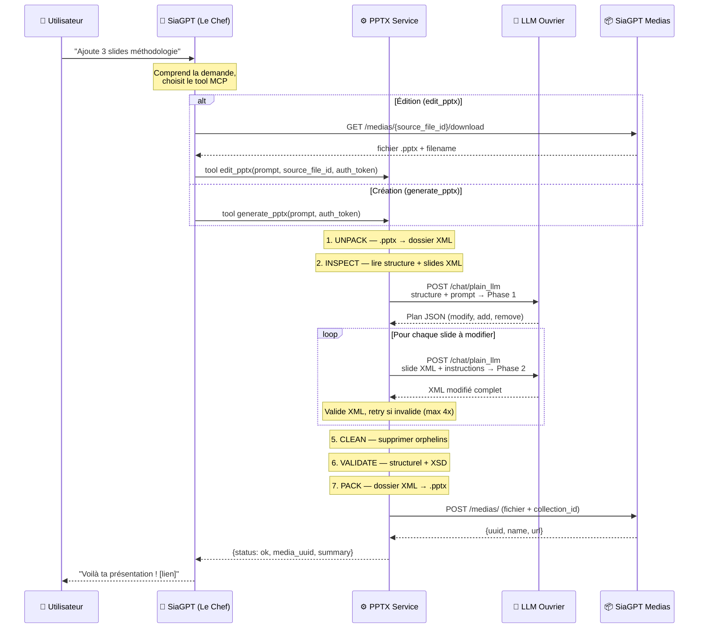

# PPTX Service

Micro-service qui génère et modifie des présentations PowerPoint via LLM.
Conçu pour s'intégrer à SiaGPT (via MCP ou API REST).

**Principe clé** : le LLM ne génère jamais de code — il lit et retourne du XML PowerPoint directement. Zéro `exec()`, zéro risque d'exécution arbitraire.

---

## Comment ça marche (vue d'ensemble)

### Petit rappel : un fichier .pptx, c'est quoi ?

Un fichier PowerPoint `.pptx` n'est rien d'autre qu'un **fichier ZIP** contenant des fichiers XML. Si tu renommes `presentation.pptx` en `presentation.zip` et que tu l'ouvres, tu verras :

```
presentation.zip/
├── [Content_Types].xml          ← "Registre" : liste tous les fichiers et leur type
├── _rels/.rels                  ← Liens entre fichiers (qui référence qui)
├── ppt/
│   ├── presentation.xml         ← La "table des matières" (ordre des slides)
│   ├── slides/
│   │   ├── slide1.xml           ← Le contenu de chaque slide (texte, positions, styles)
│   │   ├── slide2.xml
│   │   └── ...
│   ├── slides/_rels/
│   │   ├── slide1.xml.rels      ← Les liens de la slide 1 (layout, images, notes)
│   │   └── ...
│   ├── slideLayouts/            ← Les modèles de mise en page
│   ├── slideMasters/            ← Le style global (couleurs, polices du thème)
│   ├── theme/                   ← La palette de couleurs et polices
│   └── media/                   ← Les images embarquées
└── docProps/                    ← Métadonnées (auteur, date, etc.)
```

Notre service travaille directement sur ces fichiers XML — c'est comme ça qu'on modifie le texte, les styles et la structure sans jamais casser le formatage.

### Les deux LLM

Il y a deux LLM dans le système, avec des rôles distincts :

- **Le Chef** = le LLM de SiaGPT (celui à qui l'utilisateur parle dans le chat). Il comprend la demande, décide d'appeler le tool `generate_pptx` ou `edit_pptx`. Il ne touche jamais au PPTX.
- **L'Ouvrier** = le LLM appelé par ce service (via l'API `/chat/plain_llm`). Il reçoit du XML brut et des instructions techniques, et retourne du XML modifié.

### Le workflow complet

#### Diagramme visuel (rendu par GitHub)



#### Version texte détaillée (avec inputs/outputs)

```
ENTRÉES DU SERVICE
──────────────────
• prompt          : "Ajoute 3 slides sur la méthodologie" (texte libre)
• source_file_id  : UUID du PPTX source dans SiaGPT Medias (édition uniquement)
• auth_token      : Bearer token SiaGPT (passé par le Chef)
• collection_id   : UUID de la collection cible (variable d'env SIAGPT_COLLECTION_ID)

WORKFLOW INTERNE
────────────────
                                    ┌─── Fichier source ───┐
                                    │  (depuis SiaGPT       │
                                    │   Medias ou squelette) │
                                    └──────────┬────────────┘
                                               │
                          ┌────────────────────▼────────────────────┐
                          │  1. UNPACK                               │
                          │     .pptx (ZIP) → dossier de fichiers    │
                          │     XML pretty-printed + smart quotes    │
                          │     escapées                             │
                          └────────────────────┬────────────────────┘
                                               │
                          ┌────────────────────▼────────────────────┐
                          │  2. INSPECT                              │
                          │     Lire structure : slides, shapes,     │
                          │     textes, positions, layouts           │
                          │     → JSON de structure                  │
                          └────────────────────┬────────────────────┘
                                               │
                          ┌────────────────────▼────────────────────┐
                          │  3. PLANIFIER (LLM Ouvrier — Phase 1)   │
                          │                                          │
                          │     Input  : structure JSON + prompt      │
                          │     Output : plan JSON                    │
                          │       • slides_to_modify                  │
                          │       • slides_to_add (duplication)       │
                          │       • slides_to_remove                  │
                          └────────────────────┬────────────────────┘
                                               │
                          ┌────────────────────▼────────────────────┐
                          │  4. MODIFIER (LLM Ouvrier — Phase 2)    │
                          │     Pour CHAQUE slide du plan :          │
                          │                                          │
                          │     Input  : XML de la slide              │
                          │            + instructions du plan         │
                          │     Output : XML modifié complet          │
                          │                                          │
                          │     ⟲ Si XML invalide → retry (max 4x)   │
                          │     ⟲ Erreur LLM envoyée pour correction  │
                          └────────────────────┬────────────────────┘
                                               │
                          ┌────────────────────▼────────────────────┐
                          │  5. CLEAN                                │
                          │     Supprimer slides orphelines,         │
                          │     fichiers non-référencés,             │
                          │     mettre à jour Content_Types          │
                          └────────────────────┬────────────────────┘
                                               │
                          ┌────────────────────▼────────────────────┐
                          │  6. VALIDATE                             │
                          │     • 8 checks structurels               │
                          │     • Validation XSD (vs original)       │
                          │     • Auto-repair xml:space              │
                          └────────────────────┬────────────────────┘
                                               │
                          ┌────────────────────▼────────────────────┐
                          │  7. PACK                                 │
                          │     Condensation XML + smart quotes      │
                          │     restaurées → fichier .pptx           │
                          └────────────────────┬────────────────────┘
                                               │
                          ┌────────────────────▼────────────────────┐
                          │  8. UPLOAD                               │
                          │     POST /medias/ → SiaGPT Medias        │
                          │     avec collection_id + auth_token      │
                          └────────────────────┬────────────────────┘
                                               │
SORTIE DU SERVICE                              ▼
─────────────────
{
  "status": "ok",
  "media_uuid": "abc-123-...",     ← UUID du fichier uploadé
  "media_name": "presentation.pptx",
  "summary": "Ajout de 3 slides méthodologie",
  "modified_slides": ["slide2.xml"],
  "added_slides": ["slide6.xml", "slide7.xml", "slide8.xml"],
  "errors": []
}
```

---

## Les outils PPTX en détail

### pptx_tools.py — Manipulation des fichiers

Ce module sait ouvrir, fermer et manipuler les fichiers PPTX. Il ne sait rien du LLM — c'est de la plomberie pure.

#### `unpack(pptx_bytes, output_dir) → str`

**Ce que ça fait** : décompresse le fichier .pptx (qui est un ZIP) dans un dossier, et rend le XML lisible.

**Pourquoi** : le XML brut de PowerPoint est minifié (tout sur une ligne, illisible). L'unpack le met en forme pour que le LLM puisse le lire et le modifier correctement.

**En plus** : escape les "smart quotes" (`"` `"` `'` `'`) en entités XML (`&#x201C;` etc.) pour éviter les problèmes d'encodage quand le LLM modifie le texte.

```
presentation.pptx (ZIP binaire)
        │
        ▼  unpack()
/tmp/unpacked/
├── [Content_Types].xml  ← XML proprement indenté
├── ppt/slides/slide1.xml  ← Lisible par le LLM
└── ...
```

#### `pack(unpacked_dir, original_bytes) → bytes`

**Ce que ça fait** : l'opération inverse de unpack — repackage le dossier en fichier .pptx.

**Pourquoi c'est pas juste un zip** : avant de zipper, il faut :
1. **Condenser le XML** : retirer l'indentation qu'on a ajoutée (PowerPoint peut mal gérer les espaces parasites)
2. **Restaurer les smart quotes** : remettre les vrais caractères Unicode
3. **Préserver la compression** : si on a le fichier original, on réutilise ses niveaux de compression pour chaque fichier interne (sinon PowerPoint peut se plaindre)

#### `clean(unpacked_dir) → list[str]`

**Ce que ça fait** : le grand ménage avant de repackager. Supprime tout ce qui ne devrait plus être là.

**Les 5 nettoyages** :
1. **Slides orphelines** : slides qui existent dans `ppt/slides/` mais ne sont plus référencées dans `presentation.xml` (ex : on a supprimé une slide du plan mais le fichier XML traîne encore)
2. **Fichiers .rels orphelins** : fichiers de relations qui n'ont plus de fichier parent
3. **Dossier poubelle** : PowerPoint crée parfois un dossier `Trash/` — on le supprime
4. **Fichiers non-référencés** : images, médias, notes qui ne sont référencés par aucun .rels
5. **Mise à jour Content_Types** : après suppression de fichiers, met à jour le registre `[Content_Types].xml`

**Pourquoi c'est critique** : sans ce nettoyage, PowerPoint affiche le message "Ce fichier est endommagé — voulez-vous le réparer ?" et peut perdre du contenu.

#### `duplicate_slide(unpacked_dir, source_filename) → dict`

**Ce que ça fait** : crée une copie exacte d'une slide existante, avec tout ce qui va avec.

**Pourquoi c'est compliqué** : dupliquer une slide dans un PPTX, ce n'est pas juste copier un fichier. Il faut :
1. Copier le XML de la slide (`slide3.xml` → `slide4.xml`)
2. Copier son fichier de relations (`.rels`)
3. Copier ses notes (si elle en a)
4. Générer de nouveaux IDs uniques (slide ID, relationship ID)
5. Enregistrer le nouveau fichier dans `[Content_Types].xml`
6. (Optionnel) l'ajouter dans `presentation.xml` à la bonne position

Retourne un dict avec les IDs générés pour pouvoir l'insérer dans la présentation.

#### `add_slide_to_presentation(unpacked_dir, sld_id, r_id, position) → None`

**Ce que ça fait** : insère une slide dans l'ordre de la présentation en modifiant `presentation.xml` et son `.rels`.

**Contexte** : `duplicate_slide` crée les fichiers mais ne touche pas à l'ordre. Cette fonction s'en charge — elle ajoute l'entrée `<p:sldId>` dans `<p:sldIdLst>` à la position voulue.

---

### pptx_validate.py — Validation complète

Ce module vérifie que le PPTX n'est pas corrompu après modification. Deux niveaux.

#### Niveau 1 — Checks structurels

| Check | Ce qu'il vérifie | Exemple d'erreur détectée |
|-------|------------------|--------------------------|
| **XML bien formé** | Chaque fichier XML se parse sans erreur | Tag non fermé, caractère invalide |
| **Namespaces** | Les préfixes dans `mc:Ignorable` sont déclarés | LLM qui retire un namespace du root element |
| **IDs uniques** | Pas de doublons dans les IDs de shapes et slides | Deux shapes avec `id="5"` dans la même slide |
| **Références .rels** | Chaque lien pointe vers un fichier existant | `.rels` qui pointe vers `slide999.xml` inexistant |
| **Content_Types** | Tous les fichiers importants sont déclarés | Slide ajoutée mais pas dans `[Content_Types].xml` |
| **Slide layouts** | Chaque layout référencé existe dans les relations | `r:id` qui ne correspond à rien |
| **Pas de doublons** | 1 seul slideLayout par slide | Bug de duplication qui crée 2 layouts |
| **Notes non partagées** | 1 notesSlide par slide maximum | 2 slides qui pointent vers la même note |

#### Niveau 2 — Validation XSD

**XSD = XML Schema Definition.** Ce sont les schémas officiels de Microsoft qui définissent la "grammaire" du format PPTX. Par exemple, le schema `pml.xsd` dit : "un `<p:sld>` peut contenir un `<p:cSld>`, qui peut contenir un `<p:spTree>`, etc."

Si le LLM invente un tag (`<p:monTrucInventé>`), les checks structurels ne le voient pas (c'est du XML valide). Mais la validation XSD le détecte immédiatement.

**Comparaison avec l'original** : les templates ont souvent des erreurs XSD pré-existantes (extensions Microsoft non-standard). Notre validateur compare avec le fichier original et ne remonte que les **nouvelles** erreurs introduites par nos modifications.

#### Auto-repair

`xml:space="preserve"` : si un texte commence ou finit par un espace (`" Texte"`, `"Texte "`), PowerPoint le supprime silencieusement à l'ouverture sauf si `xml:space="preserve"` est présent sur le tag `<a:t>`. Notre validateur l'ajoute automatiquement.

---

## Structure du projet

```
pptx-service/
├── main.py              ← Service FastAPI : REST + MCP + orchestration workflow
├── pptx_tools.py        ← Manipulation PPTX : unpack, pack, clean, duplicate
├── pptx_validate.py     ← Validation : structurelle + XSD
├── schemas/             ← Schemas XSD Office Open XML (dans Docker)
├── system_prompt.md     ← Instructions données au LLM Ouvrier
├── skill/               ← Documentation de référence (PAS dans Docker)
├── Dockerfile
├── requirements.txt
├── rebuild.sh           ← Script dev : rebuild Docker + relance
├── .env.example
└── .gitignore
```

### main.py (~960 lignes)

Le cœur du service. Contient :
- **Endpoints REST** : `/api/edit`, `/api/create`, `/api/generate`, `/api/inspect`
- **Serveur MCP** : tools `generate_pptx` et `edit_pptx` (transport SSE + Streamable HTTP)
- **Orchestration** : inspection → planification → modification XML → validation → repackage → upload
- **Fonctions core** : `_do_edit()` et `_do_create()` partagées entre REST et MCP

### pptx_tools.py (~540 lignes)

Manipulation PPTX pure. Zéro logique métier, zéro validation. Détaillé ci-dessus.

### pptx_validate.py (~680 lignes)

Validation complète en deux niveaux. Détaillé ci-dessus.

### schemas/ (~530 Ko)

Schemas XSD officiels de la norme Office Open XML (ISO/IEC 29500), copiés dans Docker pour la validation en runtime. Contient `pml.xsd` (PresentationML), `dml-main.xsd` (DrawingML), `opc-*.xsd` (packaging).

### system_prompt.md (~220 lignes)

Le "cahier des charges" du LLM Ouvrier. Définit les 2 phases (planification JSON + modification XML), le format XML PowerPoint, les bonnes pratiques et les guidelines de design. **C'est le levier principal pour améliorer la qualité.**

### skill/ — Documentation de référence

Contient le **skill PPTX original d'Anthropic** (celui que Claude utilise dans Cowork). **PAS copié dans Docker**, **PAS utilisé en runtime**. Les schemas et la logique de validation ont été extraits dans `schemas/` et `pptx_validate.py`. Reste dans le repo comme documentation pour les devs.

---

## Points d'entrée

### REST

| Endpoint | Méthode | Description |
|----------|---------|-------------|
| `/api/generate` | POST | Endpoint unifié — crée ou modifie selon présence d'un fichier |
| `/api/create` | POST | Créer un PPTX (depuis template ou squelette vierge) |
| `/api/edit` | POST | Modifier un PPTX existant (upload du fichier) |
| `/api/inspect` | POST | Structure JSON d'un PPTX |
| `/api/inspect/xml` | POST | XML brut d'une slide |
| `/health` | GET | Health check |

```bash
# Création
curl -X POST http://localhost:8000/api/create \
  -F "prompt=Crée 5 slides sur l'IA en entreprise"

# Édition
curl -X POST http://localhost:8000/api/edit \
  -F "prompt=Change tous les titres en bleu" \
  -F "file=@presentation.pptx"
```

### MCP (Model Context Protocol)

| Tool | Paramètres | Description |
|------|-----------|-------------|
| `generate_pptx` | `prompt` | Crée un PPTX, l'uploade dans SiaGPT |
| `edit_pptx` | `prompt`, `source_file_id` | Télécharge, modifie, uploade |

**URL MCP** : `http://ADRESSE:8000/mcp/sse` (Streamable HTTP/SSE)

---

## Démarrage rapide

### 1. Configuration

```bash
cp .env.example .env
# Remplir LLM_API_KEY et SIAGPT_COLLECTION_ID
```

### 2. Docker

```bash
docker build -t pptx-service .
docker run -d -p 8000:8000 --env-file .env pptx-service
```

### 3. Vérification

```bash
curl http://localhost:8000/health
```

---

## Variables d'environnement

| Variable | Requis | Défaut | Description |
|----------|--------|--------|-------------|
| `LLM_API_KEY` | Oui | — | Bearer token SiaGPT |
| `SIAGPT_COLLECTION_ID` | Oui | — | UUID de la collection cible |
| `LLM_API_URL` | Non | `https://backend.siagpt.ai/chat/plain_llm` | URL de l'API LLM |
| `LLM_MODEL` | Non | `claude-4.5-sonnet` | Modèle LLM |
| `SIAGPT_MEDIAS_URL` | Non | `https://backend.siagpt.ai/medias` | URL API Medias |
| `MAX_RETRIES` | Non | `4` | Tentatives si XML invalide |

---

## Sécurité

Le service n'exécute **aucun code généré par le LLM**. Le LLM retourne uniquement du texte (JSON pour la planification, XML pour les modifications). Le service valide le XML avant de l'écrire.

---

## Limitations connues

- **Pas de QA visuelle** : pas de vérification du rendu (nécessiterait LibreOffice)
- **Pas de gestion d'images** : le LLM ne peut pas ajouter/modifier des images
- **Pas de graphiques/charts** : les graphiques Excel embarqués ne sont pas modifiables
- **Dépendance au modèle** : Claude Sonnet 4.5 donne de bons résultats, les modèles moins capables font plus d'erreurs XML

---

## Pour aller plus loin

- **Améliorer le system prompt** (`system_prompt.md`) : ajouter des exemples XML spécifiques aux templates Sia
- **QA visuelle** : si `/plain_llm` supporte les images, intégrer LibreOffice + validation visuelle
- **Templates pré-chargés** : bibliothèque de templates Sia Partners
- **Consulter `skill/`** : les scripts originaux contiennent des patterns avancés (images, thumbnails, PDF)
